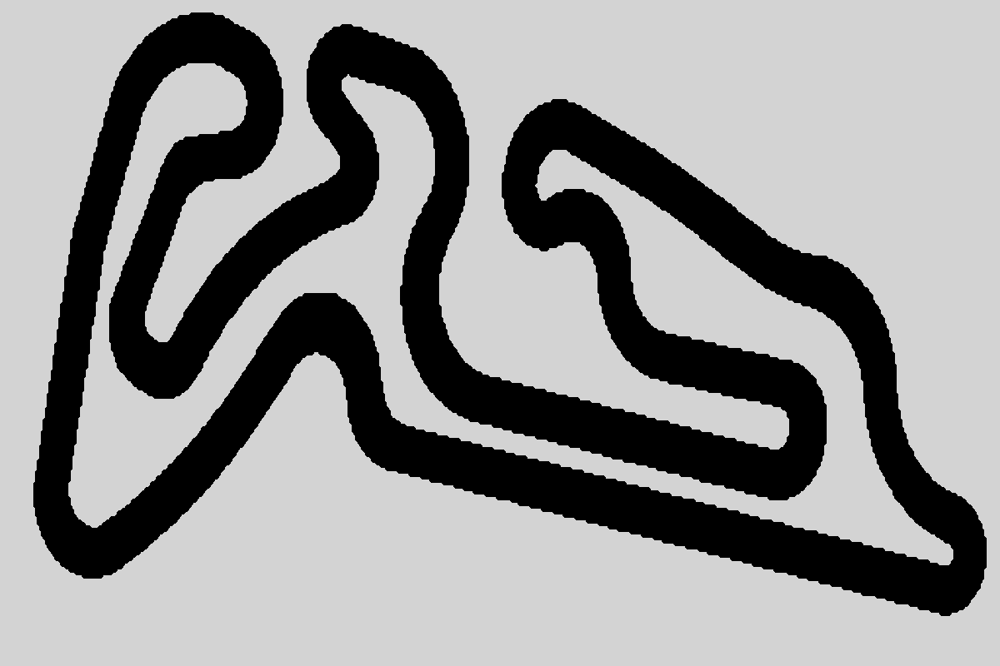

# Neural Network Evolution for 2D Autonomous Driving using NEAT

> Final project for the Bio-inspired Computing course - UFPR (2025).


## About the Project

This repository contains the implementation and experiments for the work **"Application of the NEAT Algorithm for the Evolution of Neural Networks in 2D Autonomous Driving Simulation"**.

Autonomous vehicles are a core component of Intelligent Transportation Systems. This work explores the application of the NeuroEvolution of Augmenting Topologies (NEAT) algorithm to evolve autonomous vehicle controllers within a 2D simulation environment. The objective was to evaluate decision-making across two scenarios: one where the vehicle has access to instantaneous velocity, and another relying exclusively on distance sensors. Results indicate that the inclusion of velocity facilitates problem-solving, resulting in simpler and more efficient networks.

**Authors:**
* Matheus Carara Marczuk
* Gabriel Eduardo Lima
* Prof. Eduardo Jaques Spinosa

**Read the full report:** [docs/report.pdf](docs/report.pdf) *(Note: Document in PT-BR)*. \
**Results (Videos/Topologies):** [google drive](https://drive.google.com/file/d/1Ry4nBXXmQfeShrF88L9Zy4_pmWJaHznf/view?usp=sharing).

---

## The Simulator

The simulation environment was developed in Python using `pygame`. The agent (vehicle) must navigate a track using *Ray Casting* sensors.


*Visualization of the track used in the experiments.*

### Experiment Scenarios
The code allows for the configuration of two input scenarios for the Neural Network:
1.  **With Velocity:** 5 Distance Sensors + Instantaneous Velocity (6 inputs).
2.  **Without Velocity:** Only 5 Distance Sensors (5 inputs).

---

## Installation and Requirements

This project was developed and tested using **Python 3.10.12**.

### Dependencies
The main libraries used are:
* `neat-python` (1.1.0) - Evolutionary algorithm.
* `pygame` (2.6.1) - Graphics engine.
* `opencv-python` (4.12.0) - Replay recording.
* `graphviz` (0.21) - Network topology visualization.
* `numpy` (2.2.6) - Mathematical computing.

### Installation
Clone the repository and install the dependencies:

```bash
git clone https://github.com/Lima001/PPGInf-Coursework.git
cd "PGInf-Coursework/Bio-inspired Computing/Neuroevolution/Driving Simulation"
pip install -r requirements.txt
````

> **Note:** To generate the topology graphs, you must have the [Graphviz](https://graphviz.org/download/) software installed on your operating system, in addition to the Python library.

-----

## How to Run

### 1\. Configuration (`libs/settings.py`)

Before running, check the main settings in the `libs/settings.py` file:

  * **Visualization Mode (Line 13):**
      * `HEADLESS_MODE = True`: Runs the simulation without the GUI (much faster, ideal for training).
      * `HEADLESS_MODE = False`: Shows the simulation in real-time.
  * **Experiment Scenario (Line 61):**
      * `INCLUDE_VELOCITY_IN_INPUT = True`: Includes velocity in the network input.
      * `INCLUDE_VELOCITY_IN_INPUT = False`: Uses only distance sensors.

### 2\. Running the Evolution (NEAT)

To start training the neural network:

```bash
python evolve-control.py
```

### 3\. Manual Control

To test the car physics and manually navigate the track (use the arrow keys on your keyboard):

```bash
python evolve-manual.py
```

### 4\. Visualizing Topologies

To generate the neural network image from a checkpoint file generated by `neat`:

```bash
python render_topology.py
```

-----

## Repository Structure

```plaintext
.
├── checkpoint_annotator.py  # Tool for defining checkpoints on the track
├── evolve-control.py        # Main script: executes the NEAT algorithm
├── evolve-manual.py         # Script for manual vehicle control
├── render_topology.py       # Generates graphical visualization of the neural network
├── track.png                # Track image
├── neat-config/             # Configuration files for NEAT parameters
├── docs/                    # Full report and presentation
└── libs/                    # Simulator core
    ├── car.py               # Vehicle physics and sensors
    ├── settings.py          # Global configuration parameters
    ├── ui.py                # GUI and HUD
    └── utils.py             # Auxiliary geometric functions
```